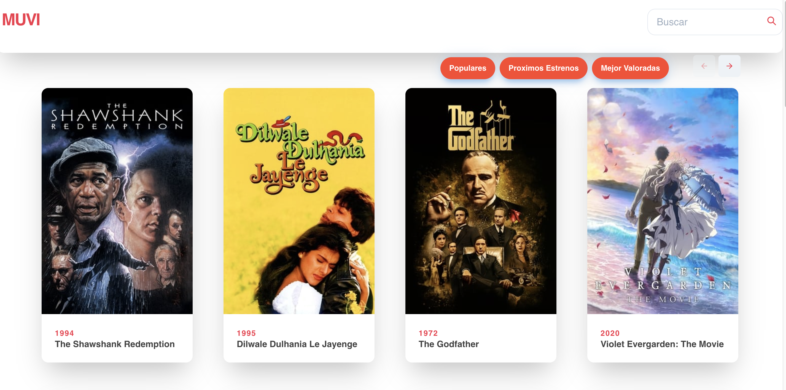

# Houm code test : Muvi


Muvi is a webpage created for a take-home assignment to join [Houm](https://houm.com/co).

The page is deployed here:

 https://houm-seven.vercel.app/

## About this proyect

Muvi is a page that lets you find the Top Rated movies in the market and also let you search by name . It uses [The Movie DB API](https://developers.themoviedb.org/3) to retrieve movie info.

## How to run locally

Clone the project, install node_modules (using npm install) 
Create local file .env.local, and put your api key in a variable:NEXT_PUBLIC_KEY=<your api key> and run

```bash
npm run dev
```

The app will be in http://localhost:3000

## Stack Used

- NextJs
- React (React Hooks)
- [Chakra UI](https://chakra-ui.com/)
- Vercel to deploy
